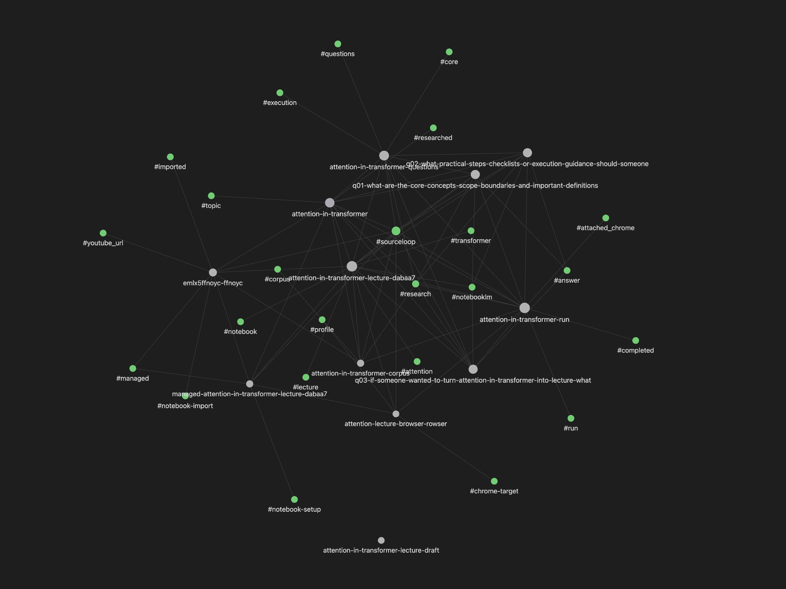

# SourceLoop

**A local-first research runtime for Codex, Claude Code, and Gemini CLI.**

SourceLoop helps AI tools work through NotebookLM with a managed browser, repeatable question planning, and local Markdown archives.

It is built for a simple idea:

- use AI for research
- keep grounding in real sources
- keep the workflow reusable
- keep human ownership over judgment and expression

SourceLoop is not a NotebookLM replacement. It is the workflow and archive layer around NotebookLM-based research.

## Why This Exists

Most research workflows break in three places:

- **weak questions**
  - the model can answer well only if someone asks the right questions
- **untrusted answers**
  - generic AI answers drift, summarize poorly, or hallucinate beyond the source base
- **no durable archive**
  - browser-only Q&A disappears into a tab and becomes hard to reuse later

SourceLoop exists to make that workflow repeatable.

It gives your AI tool:

- a topic model
- a managed NotebookLM browser path
- notebook creation or binding
- source import and source declaration
- planned question batches
- local answer and citation archives

## The IPO Model

SourceLoop follows a simple **Input -> Process -> Output** model.

### Input

- local notes, files, transcripts, and URLs
- a NotebookLM notebook
- a managed research browser session

### Process

- plan better questions
- run NotebookLM Q&A against grounded sources
- capture answers and citations into local files

### Output

- a reusable Markdown research archive
- question batches you can rerun or extend
- material that can become memos, articles, scripts, decks, or teaching assets

In short:

```text
Sources
  -> NotebookLM
  -> Planned questions
  -> Grounded answers with citations
  -> Local Markdown archive
  -> Your own memo, deck, article, or presentation
```

## What SourceLoop Gives Your AI Tool

- topic-first research workspaces
- managed Chrome setup for NotebookLM work
- notebook create or notebook bind flows
- source import for local files and supported remote URLs
- source declaration when material already exists in NotebookLM
- default 10-question planning
- full-batch execution by default unless you explicitly want a partial run
- local Markdown storage for runs, answers, and citations

## Why NotebookLM

SourceLoop uses NotebookLM as the answer engine because NotebookLM is already strong at document-grounded research.

- **Gemini-powered preprocessing**
  - upload source material once and work from prepared source context
- **natural-language Q&A**
  - go beyond keyword lookup into explanation, synthesis, and comparison
- **multi-source reasoning**
  - connect ideas across a notebook worth of source material
- **built-in citations**
  - answers come with traceable source references
- **no separate RAG infrastructure**
  - no vector database, embedding pipeline, chunking strategy, or retrieval tuning stack to maintain

SourceLoop does not try to replace those strengths. It makes them operational for AI tools.

## Markdown-First Output

SourceLoop is designed so the result does not disappear into a browser tab.

Every run is captured as local Markdown artifacts:

- planned questions
- NotebookLM answers
- citation-backed notes
- run-level archives

This makes the output:

- **easy to reuse**
  - turn answers into memos, decks, scripts, articles, or teaching material
- **easy to search**
  - keep everything in local files instead of browser history
- **easy to extend**
  - use previous runs as source material for later research
- **easy to organize**
  - keep an Obsidian-friendly archive that can grow into a real knowledge base
- **easy to version**
  - fit naturally into Git-based workflows

SourceLoop does not just help you get answers. It helps you keep them in a form you can build on.

## Security Model

SourceLoop recommends using a dedicated SourceLoop-managed Chrome profile for research work.

- do not use your normal personal Chrome profile as the preferred research path
- `sourceloop chrome launch` creates a separate research browser profile
- after signing in to Google and NotebookLM once, you can keep reusing that research session
- this keeps research activity separate from your personal cookies, tabs, and extension context
- if the preferred SourceLoop browser is unavailable, another Chrome session can still be used, but only after explicit user approval

In short:

- preferred path: a dedicated research browser
- fallback path: another existing Chrome session
- fallback use requires explicit user confirmation

## Installation

```bash
# Install the CLI globally
npm install -g sourceloop

# Go to your project
cd /path/to/your/project

# Initialize SourceLoop
sourceloop init

# Install project-local AI bootstrap
sourceloop init --ai codex
sourceloop init --ai claude
sourceloop init --ai gemini
```

## Usage

Use SourceLoop through your AI tool in plain language.

### Start New Research

You can say:

```text
Start research on attention in transformers.
```

Or:

```text
Start research on attention in transformers and use this video first:
https://www.youtube.com/watch?v=eMlx5fFNoYc
```

SourceLoop helps the AI tool:

- prepare a managed research browser
- create a topic and notebook
- import the provided sources
- plan a question batch
- archive answers and citations locally

### Continue Existing Research

You can say:

```text
Continue research from this NotebookLM notebook:
https://notebooklm.google.com/notebook/<real-notebook-id>
```

SourceLoop helps the AI tool:

- bind the existing notebook
- inspect the current research state
- continue planning or running from there

### If You Prefer Direct CLI

Use the Golden Path below.

## Golden Path

```bash
mkdir my-research-workspace
cd my-research-workspace
sourceloop init --ai codex

sourceloop status --json
sourceloop doctor --json

sourceloop topic create --name "AI agents market" --json

# visible setup step: launch a dedicated research browser,
# sign in yourself, then validate NotebookLM home access
sourceloop chrome launch --name work-chrome
sourceloop attach validate attach-work-chrome

sourceloop notebook-create \
  --name "AI Agents" \
  --topic-id topic-ai-agents-market \
  --attach-target attach-work-chrome \
  --json

# read the returned binding id from JSON or status output
sourceloop ingest ./research-notes.md --topic topic-ai-agents-market

sourceloop notebook-import \
  --notebook <managed-notebook-binding-id> \
  --source-id <source-id> \
  --json

sourceloop notebook-import \
  --notebook <managed-notebook-binding-id> \
  --url "https://youtube.com/watch?v=..." \
  --json

sourceloop plan topic-ai-agents-market --max-questions 10 --json
sourceloop run <run-id> --json
```

## Operator Defaults

If you use SourceLoop through Codex, Claude Code, Gemini CLI, or another local AI tool, these are the intended defaults:

- start with `sourceloop status --json` and `sourceloop doctor --json`
- ask for the topic first if the user did not provide one
- if the user provided a topic but not sources, ask which sources to use before collecting or importing anything
- mention that planning defaults to 10 questions unless the user wants another count
- prefer `sourceloop chrome launch` over attaching to an unrelated Chrome profile
- treat `sourceloop attach validate <target>` as NotebookLM home validation
- use `--notebook-url` only when you specifically need to validate an existing notebook detail page
- after initial setup, prefer hidden notebook actions by default and use `--show-browser` only for debugging or when the user wants to watch
- if the plan was created for 10 questions and the user did not ask for a partial pass, run the planned batch end to end
- use `--limit` only for explicit partial runs
- tell the user briefly that NotebookLM actions can take a bit before waiting
- if the wait becomes long, ask whether to keep waiting or report the current state
- if the preferred SourceLoop browser is unavailable, ask whether to continue with the current Chrome or switch back to the SourceLoop browser

## Existing Notebook Path

If the notebook already exists and already has sources loaded in NotebookLM:

```bash
sourceloop notebook-bind \
  --name "AI Agents" \
  --topic-id topic-ai-agents-market \
  --url "https://notebooklm.google.com/notebook/<real-notebook-id>" \
  --attach-target attach-work-chrome \
  --json

sourceloop notebook-source declare \
  --topic-id topic-ai-agents-market \
  --notebook <notebook-binding-id> \
  --kind mixed \
  --title "AI agents market source set" \
  --json
```

## Partial Runs and Backfills

Use partial execution only when you explicitly want it.

```bash
sourceloop run <run-id> --limit 2 --json
sourceloop run <run-id> --from-question <question-id> --json
sourceloop run <run-id> --question-id <question-id> --json
sourceloop import-latest <run-id> --question-id <question-id> --show-browser
```

## Machine-Readable Workflow

Core operator commands support `--json`:

- `topic create|list|show`
- `notebook-create`
- `notebook-bind`
- `notebook-import`
- `notebook-source declare|list|show`
- `plan`
- `run`
- `status`
- `doctor`

Example:

```bash
sourceloop status --json
sourceloop doctor --json
sourceloop topic create --name "AI agents market" --json
sourceloop chrome launch --name work-chrome
sourceloop attach validate attach-work-chrome
sourceloop notebook-create --name "AI Agents" --topic-id topic-ai-agents-market --attach-target attach-work-chrome --json
sourceloop notebook-import --notebook <managed-notebook-binding-id> --url "https://youtube.com/watch?v=..." --json
sourceloop plan topic-ai-agents-market --max-questions 10 --json
sourceloop run <run-id> --json
```

## Vault Layout

```text
vault/
├─ chrome-targets/
├─ notebook-imports/
├─ notebook-setups/
├─ notebooks/
├─ notebook-sources/
├─ runs/
├─ sources/
└─ topics/
```

Main result:

```text
vault/runs/<run-id>/
├─ index.md
├─ questions.md
└─ exchanges/
   ├─ q01....md
   ├─ q02....md
   └─ ...
```

## Project Boundary

SourceLoop stops at research packaging and Q&A archive creation.

- humans choose the topic
- NotebookLM answers from the bound notebook
- SourceLoop stores the research trace
- humans turn that archive into slides, scripts, memos, lessons, or deliverables

This is the intended split:

- use AI for research
- use humans for judgment and expression

## Current Status

Current focus:

- topic-first NotebookLM workflow
- managed notebook setup workflow
- attached Chrome execution
- Obsidian-friendly Markdown archive

Still rough around:

- NotebookLM UI selector stability
- citation capture fidelity
- automatic NotebookLM source introspection beyond operator-declared manifests

## Development

```bash
pnpm install
pnpm build
pnpm test
```

For local CLI usage:

```bash
pnpm install
pnpm build
pnpm link --global

sourceloop init --ai codex
sourceloop --help
```

Reference docs:

- [Architecture](./docs/architecture.md)
- [LLM Playbook](./docs/llm-playbook.md)
- [Tasks](./docs/tasks.md)
- [Test Plan](./docs/test-plan.md)
